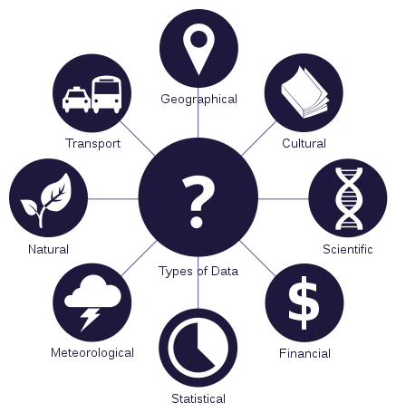

```{r setup, include=FALSE}
knitr::opts_chunk$set(echo = TRUE)
```

## Data Scientist

A job in data science blends math, statistics, and computer science; it exists somewhere between business and information technology. A data scientist’s main objective is to spot trends in large amounts of data. These trends are used to solve complicated business-related problems, helping business performance. **Data visualization** is one of the most important skills for a data scientist to master, as it allows for easier analysis and clear communication of the data. *For more information, go to:* <https://www.sas.com/en_us/insights/analytics/what-is-a-data-scientist.html>.
<center>



</center>

  ``` {r}
  version
  ```